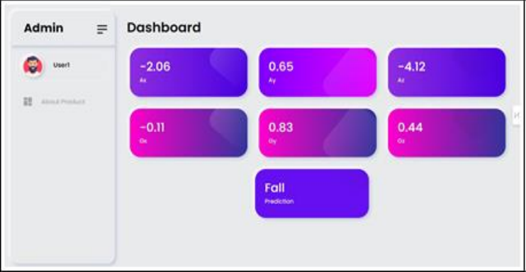

# Fall Detection and Activity Monitoring System

## 🔍 Overview
This project presents an IoT-enabled wearable device for real-time human activity recognition, specifically fall detection, using supervised machine learning. By integrating an MPU6050 motion sensor, an ESP8266 microcontroller, and Firebase cloud services, the system offers reliable monitoring of daily activities like sitting, standing, walking, and falling, mainly targeting elderly care.

> 📄 *This implementation is based on the research paper:* **"Integrating IoT and Machine Learning for Fall Detection and Activity Monitoring"** by Vijaylaxmi Bittal, Mayur Jain, Shruti Patil, and Harshada Patil.

## 🧠 System Architecture

The system consists of a wearable device that captures motion data via sensors and transmits it to Firebase. A pre-trained machine learning model classifies the activity in real-time.

**Key Components:**
- **MPU6050**: 3-axis accelerometer + 3-axis gyroscope sensor
- **ESP8266**: Wi-Fi-enabled microcontroller
- **Firebase**: For real-time database and cloud function triggers

## ⚙️ Hardware Setup

| Component       | Description |
|----------------|-------------|
| MPU6050        | Measures linear acceleration and angular velocity |
| ESP8266        | Sends data via Wi-Fi to Firebase |
| Power Supply   | 5V external battery |

### Circuit Connections:
- MPU6050 VCC -> ESP8266 3.3V
- MPU6050 GND -> ESP8266 GND
- MPU6050 SDA -> ESP8266 D1
- MPU6050 SCL -> ESP8266 D2

## 🔁 Working Principle
1. **Sensor Data Collection**: Acceleration and gyroscopic values are averaged over a 3.5-second window.
2. **Data Transmission**: ESP8266 pushes data securely to Firebase using HTTPS.
3. **Cloud Processing**: Firebase Functions invoke a pre-trained machine learning model.
4. **Prediction & Alerting**:
   - Predicts activity: Sit, Stand, Walk, or Fall
   - Sends alert via Firebase Cloud Messaging if a fall is detected

## 📊 Machine Learning

### Features Extracted
- Mean, Variance, Standard Deviation, and Signal Magnitude Area (SMA) from AX, AY, AZ, GX, GY, GZ

### Models Used
- K-Nearest Neighbors (KNN)
- Decision Tree (DT)
- Support Vector Machine (SVM)
- Logistic Regression (LR)
- Bayes-Gaussian (BG)
- Random Forest (RF)

**Best Model**: **Random Forest**
- Fall Detection Accuracy: **96%**
- F1 Score: **95.5%**
- AUC: **0.98**

## 📦 How to Use

### Prerequisites
- ESP8266 Board with Arduino support
- Firebase Project (Realtime Database, Cloud Functions, FCM enabled)
- Arduino Libraries: `ESP8266WiFi.h`, `Wire.h`, `FirebaseESP8266.h`

### Setup Instructions
1. Upload the Arduino code to the ESP8266
2. Connect your mobile hotspot or local Wi-Fi
3. Deploy Firebase Cloud Functions with the trained model
4. Monitor real-time activity via your app or dashboard

## 📸 Sample Output

